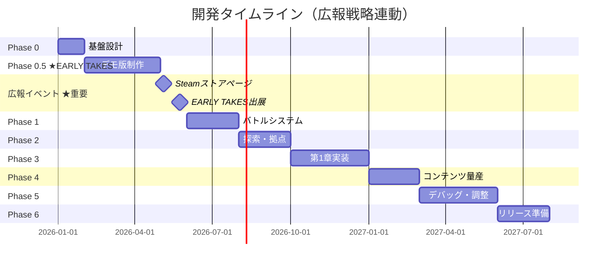

# 『流転のジェミニ』開発マスタープラン v2.1

**最終更新**: 2026-03-03
**戦略変更**: EARLY TAKES出展（5/24）を新マイルストーンに追加

---

## 全体スケジュール概要（改訂版）

| Phase | 期間 | 主な成果物 | 広報マイルストーン |
|-------|------|-----------|-------------------|
| **0** | 2026年1月〜2月 | データクラス・基盤設計完了 | - |
| **0.5** ⭐ | 2026年2月〜5月 | **デモ版（町探索+会話）・グラフィック整備** | **Steamストアページ開設 → EARLY TAKES出展** |
| **1** | 2026年6月〜8月 | 戦闘システムプロトタイプ | 動画素材作成開始 |
| **2** | 2026年8月〜10月 | 探索ループ完成 | 重いセリフ動画投稿 |
| **3** | 2026年10月〜2027年1月 | 第1章完成（α版） | - |
| **4** | 2027年1月〜3月 | 全シナリオ・ダンジョン実装 | 体験版配布準備 |
| **5** | 2027年3月〜6月 | デバッグ・バランス調整 | 体験版配布・実況者アプローチ |
| **6** | 2027年6月〜8月 | リリース準備・公開 | PV作成・最終告知 |

> **目標リリース**: 2027年夏
> **最重要マイルストーン**:
> - **2026年5月5日**: Steamストアページ開設（Coming Soon）
> - **2026年5月24日**: EARLY TAKES出展（WebGLデモ公開）

---

## 戦略変更の理由

### v2.0（2026-01-11）: グラフィック優先戦略
- ❌ 旧プラン: グラフィックが後回しで、**見せられる画面**が完成するのが遅い
- ✅ 新プラン: **2026年5月にSteamストアページ開設**（ウィッシュリスト貯金開始）
- ✅ システムはClaude Codeで後から短期間で実装可能

### v2.1（2026-01-17）: EARLY TAKES出展決定
- 🎯 **2026年5月24日「インディーゲームWEBオンリー【EARLY TAKES】」に出展**
- 🎯 WebGLビルドで**実際に触れるデモ**を公開
- 🎯 デモ内容: **町の探索 + パートナーとの会話**（戦闘なし）
- ✅ 世界観とキャラクターの魅力を体験してもらう方向性
- ✅ 戦闘システムは6月以降に後回し（デモには不要）

---

## 【Phase 0: 基盤クラスの設計】
**期間**: 2026年1月〜2月前半
**目標**: 全システムの土台となるデータクラスを整備

### 1. キャラクターデータ基盤
- ✅ **CharacterData クラス**: 完了（獣フラグ追加済み）
- ✅ **StatusParameter クラス**: 完了（感情システム統合済み）
- ✅ **初期データ作成**: 6キャラ分のアセット作成済み

### 2. アイテムデータ基盤
- ✅ **ItemData 基底クラス**: 完了
- ✅ **WeaponData / ArmorData / ConsumableData / KeyItemData**: 完了
- ✅ **CSV → ScriptableObject インポーター**: 完了

### 3. 感情システム基盤
- ✅ **EmotionParameter クラス**: 完了
- ✅ **EmotionEffect 定義**: 完了
- ✅ **感情変化トリガー**: 仕様定義完了

### 4. 状態異常システム
- ⬜ **Ailment enum**: 次回実装 → #55
- ⬜ **状態異常効果テーブル**: 次回実装

### 5. パッシブスキル（加護）システム
- ⬜ **PassiveSkillData クラス**: 次回実装 → #56
- ⬜ **SkillData クラス**: 次回実装 → #57

**Phase 0 進捗**: 60% 完了（3/5）

---

## 【Phase 0.5: EARLY TAKESデモ版制作】⭐ 最重要
**期間**: 2026年1月〜5月24日
**目標**: **EARLY TAKESで「触れるデモ」を公開 + Steamストアページ開設**
**優先度**: 🔥 最優先 🔥

### 最重要マイルストーン
1. **2026年5月5日（GW中）**: Steamストアページ公開（Coming Soon）
2. **2026年5月24日**: EARLY TAKES出展（WebGLデモ公開）

---

### デモ版の内容
**コンセプト**: 「死後の世界」の世界観 + パートナーとの戯れを体験

| 要素 | 内容 | 必須/任意 |
|------|------|----------|
| **マップ** | 拠点（パートナーの家）+ 周辺の町 | 必須 |
| **会話システム** | NPC会話・パートナーとの掛け合い | 必須 |
| **立ち絵** | 表情差分あり | 必須 |
| **移動** | プレイヤーキャラの歩行 | 必須 |
| **雰囲気** | BGM、ライティング | 必須 |
| 戦闘システム | - | 不要 |
| アイテム管理 | - | 不要 |
| セーブ/ロード | - | 不要（短いデモ） |

---

### 必須タスク（システム実装）

#### 1. シナリオエンジン拡張 🔥最優先
**現状**: テキスト表示・選択肢・フラグ分岐は動作する
**不足**: 立ち絵表示、表情差分、話者名表示、背景切り替え

| コマンド | 説明 | 優先度 |
|---------|------|--------|
| **CharShow** | 立ち絵を表示（位置指定: left/center/right） | SS |
| **CharHide** | 立ち絵を非表示 | SS |
| **CharFace** | 表情差分を切り替え | SS |
| **Speaker** | 話者名をUIに表示 | S |
| **BGImage** | 背景画像を切り替え | S |
| クリック待ち改善 | 固定秒数 → クリック/Enter待機 | A |

**作業量**: 10〜15時間（Claude Code実装）

#### 2. マップ移動システム
**必要機能**:
- [ ] PlayerController（トップダウン2D移動）
- [ ] NPC会話トリガー（近づいて決定キーで会話開始）
- [ ] マップ遷移（家 ↔ 町）
- [ ] カメラ追従

**作業量**: 10〜15時間（Claude Code実装）

#### 3. WebGLビルド対応
- [ ] WebGLビルド設定
- [ ] unityroom または itch.io へのアップロード
- [ ] 動作確認（ブラウザ互換性）

**作業量**: 3〜5時間

---

### 必須タスク（グラフィック）

#### 4. 立ち絵の表情差分追加 🔥最優先
**優先キャラ**: カイリ、ルイ（パートナー）、ナギ、ミズキ（主人公）

- [ ] 各キャラ 5〜7パターンの表情差分
  - 通常、喜び、怒り、哀しみ、恐怖、驚き、照れ
- [ ] 感情システムと連動した差分を優先

**作業量**: 20〜30時間（主要4キャラ分）

#### 5. 町マップの作成・見栄え調整
- [ ] FSM素材で「パートナーの家」マップ作成
- [ ] FSM素材で「町」マップ作成（小規模でOK）
- [ ] Unity 2D Lightingでライティング演出
- [ ] 「死後の世界」らしい雰囲気作り

**作業量**: 15〜20時間

#### 6. 会話UI整備
- [ ] テキストボックスのデザイン
- [ ] 話者名表示エリア
- [ ] ダークファンタジーに合うフォント選定

**作業量**: 5〜10時間

---

### Steamストアページ用素材（5/5まで）

#### 7. メインビジュアル（カプセ画像）作成
**優先度**: SS

- [ ] ナギ・カイリ・ミズキ・ルイ・ペチの立ち絵を使用
- [ ] 一枚絵として構図を組む（キービジュアル）
- [ ] 背景加工（フリー素材 + 色調補正）
- [ ] Steamカプセ画像サイズ（616x353px）で出力
- [ ] タイトルロゴを配置

**作業量**: 20〜30時間

#### 8. スクリーンショット・紹介文
- [ ] スクリーンショット 5〜10枚
  - 町マップ（ライティング済み）
  - 会話シーン（立ち絵 + テキストボックス）
  - キービジュアル
- [ ] 紹介文執筆
  - 「死後の世界」「記憶喪失」「愛と断罪」
  - 500〜1000文字程度

**作業量**: 5〜10時間

---

### Phase 0.5 スケジュール

| 期間 | タスク | 担当 |
|------|--------|------|
| **1月後半** | シナリオエンジン拡張（立ち絵・表情差分対応） | Claude Code |
| **2月** | マップ移動システム実装、表情差分作成開始 | Claude Code + 手作業 |
| **3月** | 町マップ作成、会話UI整備、デモシナリオ執筆 | 手作業 |
| **4月** | キービジュアル作成、Steam素材準備 | 手作業 |
| **5月前半** | Steamストアページ開設、WebGLビルド | 両方 |
| **5月24日** | **EARLY TAKES出展** | 🎉 |

### Phase 0.5 総作業時間の目安
**合計**: 90〜130時間（約4ヶ月 = 週6〜8時間ペース）

- システム実装（Claude Code）: 25〜35時間
- グラフィック（手作業）: 65〜95時間

---

## 【Phase 1: バトルシステムの実装】
**期間**: 2026年5月後半〜7月
**目標**: 「戦闘開始→コマンド選択→行動実行→勝敗判定」が動作するプロトタイプ

**戦略**: Phase 0.5で作成したUIモックアップに**実際の動作を組み込む**

### 1. バトルマネージャー
- [ ] **BattleManager**: ターン制バトルのステートマシン
  - Claude Codeに仕様を渡して実装
- [ ] **SkillExecutor**: ダメージ計算
- [ ] **UI連携**: Phase 0.5で作ったUIを動かす

### 2. 武器カテゴリ効果
- [ ] 短剣、片手剣、棍、片手杖、槍、両手剣、大槌、両手杖の特殊効果実装

### 3. 防具カテゴリシステム
- [ ] 盾、軽装、重装、霊装、補助防具、装飾品の効果実装

### 4. ペチの変身システム（豹変）
- [ ] 4ターン後に強制解除
- [ ] 解除時に睡眠状態

### 5. 敵データ・AI設計
- [ ] EnemyData クラス
- [ ] 行動パターンテンプレート

### 6. 敗北・再挑戦システム
- [ ] 「まだ諦めない」「諦める」選択肢

**Phase 1 重要ポイント**: ここで「動画素材」が作れるようになる
→ XやYouTubeショートで**戦闘シーンの短尺動画**を投稿開始

---

## 【Phase 2: フィールド探索と拠点】
**期間**: 2026年7月〜9月
**目標**: 「移動→会話→戦闘→移動」のゲームループが遊べる状態

### 1. フィールド探索システム
- [ ] PlayerController（トップダウン移動）
- [ ] インタラクション（宝箱、NPC会話）
- [ ] ランダムエンカウント/シンボルエンカウント

### 2. ダンジョンギミックシステム
- [ ] 加護連動ギミック（水巡、遡上、壁翔、炎砕、風読）
- [ ] 隠し部屋（フェアリーテイルフレア）
- [ ] 青い宝箱（鏡のかけら）

### 3. パートナーの家（拠点）
- [ ] タイルマップでマップ作成
- [ ] ベッド（回復）、セーブポイント
- [ ] パートナーショップ

### 4. セーブ/ロード
- [ ] SaveManager（JsonUtility）

### 5. メモ/手帳システム
- [ ] あらすじ確認
- [ ] 重要NPCメモ
- [ ] 未読マーク

**Phase 2 重要ポイント**: ここで「バーティカルスライス」完成
→ **「重いセリフ」動画**を投稿開始（広報戦略 Phase 2）

---

## 【Phase 3: 第1章の実装とUI整備】
**期間**: 2026年9月〜12月
**目標**: プロローグから第1章終了まで通してプレイ可能な「α版」

### 1. メニュー画面・システム周り
- [ ] メインメニュー
- [ ] ItemManager
- [ ] ショップシステム
- [ ] 交換所

### 2. エンパシーシステム ⭐最重要
- [ ] Empathy値管理
- [ ] 加算条件
- [ ] 規定値チェック
- [ ] 日記読了フラグ

### 3. パートナーNPC戦闘参加システム
- [ ] 参加ON/OFF
- [ ] ターン終了時行動
- [ ] 被ダメージ時の感情変化

### 4. 第1章コンテンツ実装
- [ ] マップ（ゆらぎの森、紅蓮の洞窟、風哭きの塔）
- [ ] イベント（ペチ、カグヤ、ハヤテ加入）
- [ ] ボス戦（カグヤ戦）
- [ ] 仲間会話

### 5. 感情システムの実装
- [ ] ScenarioExecutor拡張（AddParamコマンド）
- [ ] 顔グラフィック変化
- [ ] 戦闘中の感情変化
- [ ] 感情リセット

### 6. 占い屋システム
- [ ] 有料ヒント（30G）
- [ ] 無料ヒント

---

## 【Phase 4: コンテンツ量産と拡張】
**期間**: 2026年12月〜2027年3月
**目標**: シナリオ完結までのデータ入力とアセット配置

### 1. データ量産
- [ ] シナリオ（第2章〜第4章、各エンディング）
- [ ] マップ（全10ダンジョン）
- [ ] 敵データ（ステータス、行動パターン、ドロップ）

### 2. ボス固有システム
- [ ] レフレクトス「忘我」状態
- [ ] 流転の記憶スキル（Hope End限定）
- [ ] 小さなオルゴール効果

### 3. サブシステム実装
- [ ] プレゼントシステム
- [ ] パートナーの日記
- [ ] ひよこのピヨ

### 4. 重要アイテム効果
- [ ] ちぎれた首輪（ペチ）
- [ ] アカネ草のサシェ（カグヤ）
- [ ] 古びた鉛筆（ハヤテ）

### 5. 演出強化
- [ ] DOTween活用
- [ ] サウンド（BGM/SE）
- [ ] エンディング演出

**Phase 4 重要ポイント**: ここで「体験版」完成
→ **ふりーむ！・itch.io で体験版配布**（広報戦略 Phase 3）

---

## 【Phase 5: ポリッシュとデバッグ】
**期間**: 2027年3月〜6月
**目標**: クオリティアップとバグ撲滅

### 1. 全体テストプレイ
- [ ] 難易度調整
- [ ] シナリオ分岐チェック
- [ ] エンパシー値による分岐確認
- [ ] 誤字脱字修正

### 2. ビジュアル・UX強化
- [ ] UIアニメーション
- [ ] エフェクト（パーティクル）
- [ ] 操作性改善（コントローラー対応）

### 3. クリア後コンテンツ（Hope End限定）
- [ ] 2人パーティモード
- [ ] 眷属スキル解放
- [ ] プレゼント拡張
- [ ] 浄化モード
- [ ] 拠点「眷属の間」

### 4. ビルド設定
- [ ] Windows/Mac/WebGL向けビルド
- [ ] 動作確認・パフォーマンス最適化

**Phase 5 重要ポイント**: 実況者アプローチ本格化

---

## 【Phase 6: リリース準備】
**期間**: 2027年6月〜8月
**目標**: 作品の公開

### 1. 配布準備
- [ ] Readme、操作説明書
- [ ] ふりーむ！、PLiCy、itch.ioページ作成
- [ ] **PV作成**、スクリーンショット撮影

### 2. リリース
- [ ] 公開とSNS告知
- [ ] ウィッシュリスト→購入の転換率モニタリング

---

## 開発のポイント・注意点

### 1. Phase 0.5を軽視しない
**グラフィック整備が全ての土台**。ここをサボると広報戦略が崩壊する。

### 2. Steamストアページは最重要マイルストーン
2026年5月のストアページ開設を絶対に守る。ここから1年以上かけてウィッシュリストを貯める。

### 3. 「逆・写経」の継続
バトル処理やセーブデータ管理などのコア部分は、AIにコードを書かせた後、必ず「なぜ動くのか」を理解する時間を設ける。

### 4. 無理のないペースで
**目標は2027年夏リリース**。急ぎすぎず、品質を優先。「進捗がない日があってもOK」というスタンスで継続が鍵。

---

## 進捗チェックリスト

### Phase 0 ✅/🔄/⬜
- [x] CharacterData クラス
- [x] StatusParameter クラス
- [x] ItemData / WeaponData / ArmorData / ConsumableData
- [x] KeyItemData
- [x] CSV → ScriptableObject インポーター
- [x] EmotionParameter クラス → #48 ✅
- [ ] Ailment enum（状態異常） → #55
- [ ] PassiveSkillData（加護） → #56
- [ ] SkillData クラス + CSVローダー → #57

### Phase 0.5 ⭐ EARLY TAKES対応 🔄
**システム実装（Claude Code）**
- [x] シナリオエンジン拡張（CharShow/CharHide/CharFace）← Textコマンド統合方式で実装
- [x] 話者名表示（Speaker）
- [x] 背景画像切り替え（BGImage）
- [x] クリック待ち改善（WaitForClick）
- [x] PlayerController（マップ移動）
- [x] NPC会話トリガー（NPCTrigger）
- [x] 外部シナリオ開始API（StartScenario/StopScenario/IsRunning）
- [x] マップ遷移システム（家↔町）← MapTransition.cs、FadeManager.cs
- [x] カメラ追従 ← CameraFollow.cs
- [x] 町タイルマップ自動配置ツール ← TownMapBuilder.cs、TileMapping.cs、town_map.csv
- [ ] WebGLビルド対応

**グラフィック（手作業）**
- [ ] 立ち絵の表情差分追加（カイリ、ルイ、ナギ、ミズキ）
- [ ] 町マップ作成（パートナーの家 + 町）
- [ ] 会話UI整備（テキストボックス、話者名）
- [ ] メインビジュアル（カプセ画像）作成
- [ ] Steamストアページ用素材準備

**マイルストーン**
- [ ] **Steamストアページ公開**（2026年5月5日）
- [ ] **EARLY TAKES出展**（2026年5月24日）

### Phase 1 ⬜
- [ ] BattleManager
- [ ] SkillExecutor
- [ ] 武器カテゴリ効果
- [ ] ペチ変身システム
- [ ] EnemyData + AI
- [ ] 敗北・再挑戦システム

### Phase 2 ⬜
- [ ] PlayerController
- [ ] ダンジョンギミック
- [ ] 拠点マップ
- [ ] セーブ/ロード
- [ ] メモ/手帳システム

### Phase 3 ⬜
- [ ] メニュー画面
- [ ] エンパシーシステム
- [ ] パートナーNPC戦闘参加
- [ ] 第1章コンテンツ
- [ ] 感情システム実装
- [ ] 占い屋システム

### Phase 4 ⬜
- [ ] 第2〜4章シナリオ
- [ ] 全ダンジョンマップ
- [ ] レフレクトス忘我システム
- [ ] 流転の記憶スキル
- [ ] プレゼントシステム
- [ ] パートナーの日記
- [ ] ひよこのピヨ
- [ ] **体験版配布**

### Phase 5 ⬜
- [ ] バランス調整
- [ ] クリア後コンテンツ
- [ ] ビルド設定

### Phase 6 ⬜
- [ ] 配布準備
- [ ] **リリース**

---

## まとめ

### 戦略の核心
1. **グラフィック優先**でSteamストアページを早期開設
2. システムはClaude Codeで後から実装
3. **「見た目で魅了」→「文章で惹きつけ」→「AIで実装」**

### 次の一歩
**Phase 0.5 のグラフィック整備**を2月から開始しましょう！
